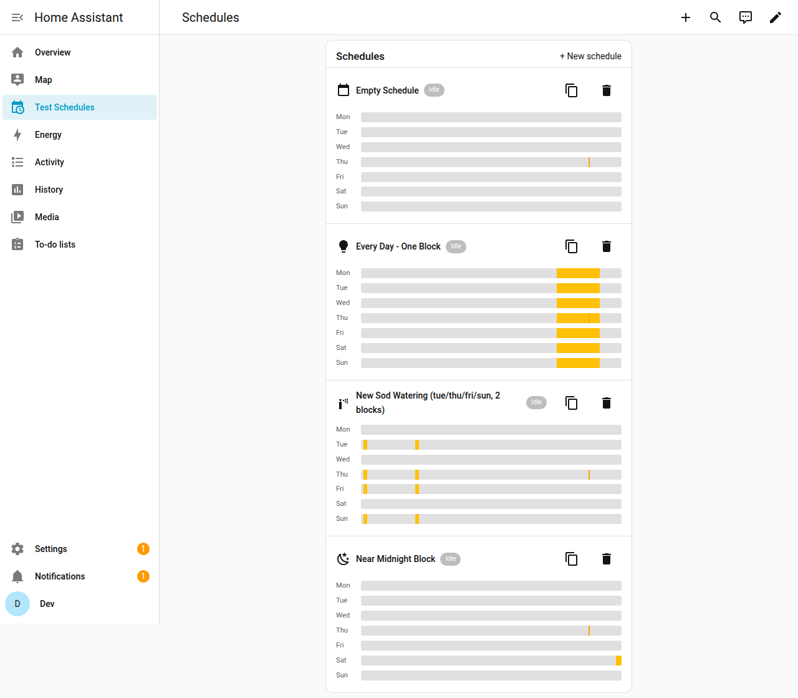
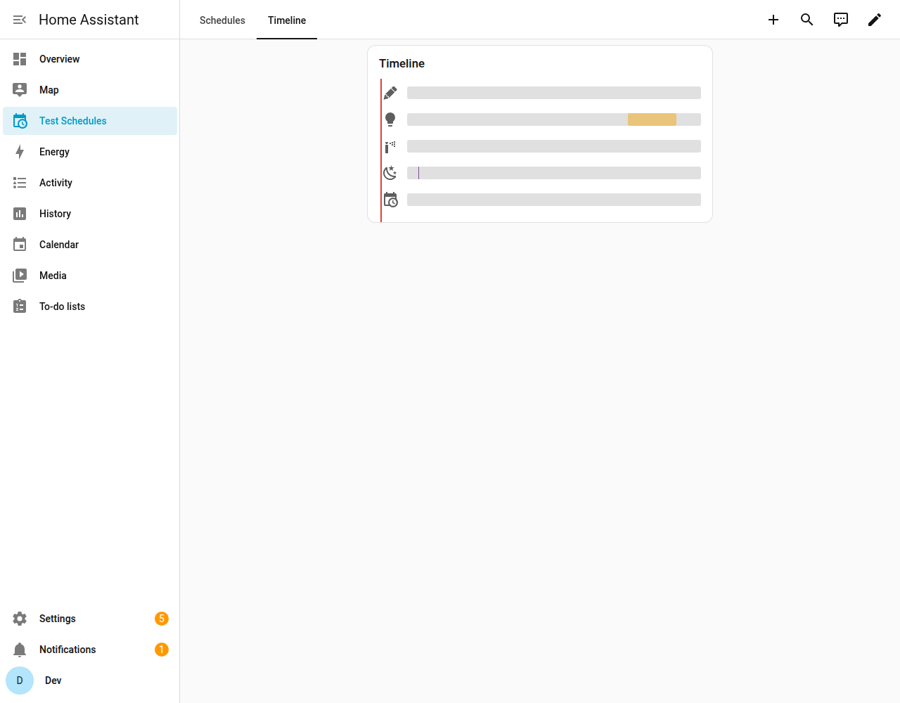

# Schedule Editor Card

Two Lovelace cards, one package, for Home Assistant's **native `schedule`
helper domain**:

- **`schedule-editor-card`** — create, edit, duplicate and delete weekly
  schedules, pick the icon and color, and pick which entities they control,
  all from your dashboard.
- **`schedule-timeline-card`** — a read-only, at-a-glance view: one track
  per schedule, today's blocks, a shared "now" line moving across all of
  them together.





Home Assistant's built-in Schedule helper computes its on/off state live from
the clock (not from a one-time trigger), which makes it a good fit for
anything actuating real equipment — it doesn't get stuck in the wrong state
if Home Assistant is restarted or offline through a scheduled boundary. But
the only way to edit one has been the Helpers settings page, one schedule at
a time, with no dashboard view across several. This card fixes that.

`schedule-editor-card` only edits `schedule.*` entities themselves (the
weekly time blocks, icon, color) plus the optional binding to real entities —
see [Controlling entities from a schedule](#controlling-entities-from-a-schedule)
below for how that last part works.

## Installation (HACS)

1. HACS → the three-dot menu → **Custom repositories**.
2. Add this repo's URL, category **Dashboard** (plugin).
3. Install "Schedule Editor Card", then add the resource if HACS doesn't do
   it automatically (Settings → Dashboards → Resources).

## Usage

```yaml
type: custom:schedule-editor-card
title: Schedules
# Optional - omit to show every schedule.* entity that exists.
entities:
  - schedule.new_sod_watering
```

```yaml
type: custom:schedule-timeline-card
title: Timeline
# Optional, same meaning as above.
entities:
  - schedule.new_sod_watering
```

Click a schedule's icon (in `schedule-editor-card`) to change it, or the
color swatch next to the entity controls to pick a color — both apply to
that schedule everywhere, including in `schedule-timeline-card`. Colors are
stored via Home Assistant's own per-user data storage (the same mechanism
the frontend itself uses for things like dashboard state), not
`localStorage`, so they follow your account across devices/browsers rather
than being stuck to one.

Each block is shown as *one row per time range*, not one per day — "time is
the unit, days are a property of it," e.g. one `08:00–08:20` row with day
pills for Mo/Tu/We/Th/Fr/Sa/Su, rather than seven identical rows. Click the
time to edit it (applies to every day currently checked); click a day pill
to add or remove just that one day.

In the timeline card, click a track's icon to show its schedule's name (also
available as a hover tooltip on desktop); a track's bar is drawn solid when
that block is the one currently active, dimmed otherwise. Use the arrows
either side of the date to preview other days — the "now" line and active
highlighting only make sense for today, so they're hidden on any other day
you step to; click "Today" to jump back.

All "is this active right now" and "what day is today" logic (in both
cards) is computed against Home Assistant's own configured server
timezone (Settings → System → General), not the browser's — schedule
blocks are evaluated server-side in that zone, so a viewer in a different
timezone than the server still sees the correct state rather than a
locally-shifted one.

## Controlling entities from a schedule

A `schedule` entity by itself is just a weekly on/off signal — something
still has to flip real entities in response. The card manages that for
you: click the plug icon in a schedule's header to open its **controls**
panel, pick a **target** (switch/light entities, devices, areas, or
labels — group helpers work too, since they're just entities in those
same domains), and optionally set a recheck interval.

Picking a **label** (Settings → Areas, labels & zones → Labels) is often
the most useful option: label a handful of lights or the smart-plugs
behind a few humidifiers once, point a schedule's controls at that label
instead of listing each entity, and anything tagged with it later —
including a whole device, not just individually-labeled entities — gets
picked up automatically without editing the binding again.

Under the hood this creates (and keeps in sync) a small automation built
from a bundled blueprint, `local/schedule_sync.yaml` — restart-safe (it
re-asserts the correct state on schedule transitions, on Home Assistant
startup, and optionally on a fixed interval you choose per schedule) —
deterministically named `schedule_sync_<schedule id>` so the card can
find, update, or remove it without ever asking you to open Settings →
Automations. Deleting a schedule from the card also removes its bound
automation.

**Why an interval, and why off by default:** re-asserting state only at
transitions/startup means a manual override (someone turns a light back
off after the schedule turned it on) sticks until the next real
transition — usually what you want. For something where silent drift
matters more than respecting an override (e.g. a valve left open), set a
recheck interval and it'll be corrected within roughly that many minutes
instead.

**Gating on another condition:** the same panel has a second picker,
"Force off while" — pick one or more `binary_sensor`/`input_boolean`
entities, and the target is forced off (even during an otherwise-active
schedule block) any time one of them is `on`, re-evaluated the moment
that entity's state changes rather than waiting for the next transition.
The intended use is a helper that represents "don't run right now" as a
boolean: e.g. a HA **Threshold** helper turning `sensor.humidity` +
a threshold into a `binary_sensor`, so a humidifier bound to a schedule
won't run — or will actively shut off if it's already running — while
it's already too humid, regardless of what the schedule itself says.
Leave it empty (the default) for a schedule that should just follow its
own on/off state with no extra condition.

Unlike "Controls" above, this picker is entities-only — it doesn't accept
labels/devices/areas. That's deliberate, not an oversight: the condition
check happens in a template, not a service-call target, and a label
applied to a device or area doesn't resolve down to that device/area's
entities there the way it does for "Controls" - only entities labeled
directly would ever match, which would be a confusing, silently-partial
result rather than a real feature.

You'll need the blueprint itself installed once per Home Assistant
instance: copy [`local/schedule_sync.yaml`](local/schedule_sync.yaml) into
your `config/blueprints/automation/local/` directory. (A one-click My Home
Assistant import link is a nice future improvement, not done yet — see
PLAN.md.)

## Development

### Requirements

- Node 22+
- Docker + Docker Compose (for the disposable test instance)

### Build

```bash
npm install
npm run build       # bundles src/schedule-editor-card.ts -> dist/schedule-editor-card.js
npm run watch        # rebuild on change
npm test             # unit tests (time/block math) via vitest
npm run typecheck
npm run lint
```

### Testing against a real Home Assistant instance (safely)

Never test against your production Home Assistant. This repo includes a
throwaway instance you can nuke and recreate at will:

```bash
npm run build
docker compose -f dev/docker-compose.yml up -d
```

- Open http://localhost:8124 and complete the one-time onboarding (creates
  a local user; none of this touches any other Home Assistant instance).
- Settings → your profile → Security → **Create long-lived access token**.
- Seed the fixture set — the canonical, checked-in test data (not
  something reinvented each session): a handful of varied edge cases
  (empty schedule, single block, multiple blocks on specific weekdays, a
  block near midnight) plus a deliberately dense set (19 schedules,
  structured as two independent full-day-coverage "layers" so at least 2
  are always active) for testing how the UI holds up at real volume.
  Idempotent — safe to re-run any time, existing fixtures are skipped by
  name rather than duplicated:

  ```bash
  HA_HOST=localhost:8124 HA_TOKEN=<paste> node dev/seed-schedules.mjs
  ```

- Add the card to a dashboard: Settings → Dashboards → Resources → add
  `/local/community/schedule-editor-card/schedule-editor-card.js` as a
  JavaScript module, then add a `custom:schedule-editor-card` card to any
  view.
- Edit `src/`, `npm run build` (or leave `npm run watch` running), refresh
  the browser tab. The dev instance is bind-mounted straight from `dist/`,
  so no re-install step is needed between builds.
- Tear down any time with `docker compose -f dev/docker-compose.yml down -v`
  — this deletes the throwaway instance's config entirely and starts fresh
  next time.

This mirrors how most HACS frontend cards are actually tested in practice:
pure logic (date/time-block math, overlap validation) gets unit tests
(`npm test`); rendering and interaction get exercised by hand against a real
but disposable Home Assistant instance, since there isn't an established
automated-UI-testing convention in this ecosystem.

### Releasing

Push a tag matching `v*` (e.g. `v0.1.0`). The `release.yml` workflow builds
the card and attaches `schedule-editor-card.js` to a GitHub Release, which is
what HACS downloads.

## License

MIT
